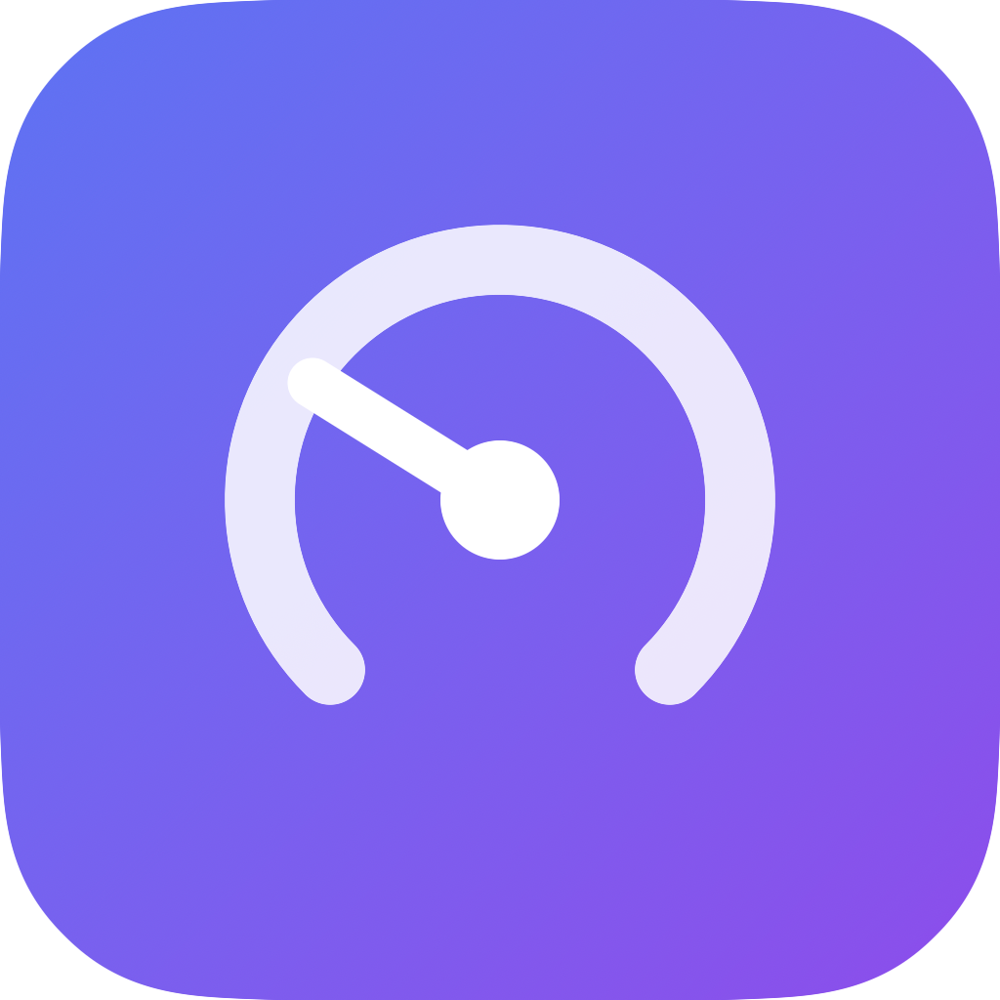

<div align="center">



# Claude Usage Meter

**An always-on macOS menu-bar app that shows how much of your Claude Code
rate limits you've used — and whether you're burning them faster than the clock.**

</div>

Claude Code subscriptions enforce two rolling rate-limit windows — **5-hour** and
**weekly (7-day)** — but the consumption against them is invisible until Claude
Code slows or stops mid-task. This app keeps both windows in your menu bar, so you
can pace your work and never get surprised by a limit.

---

## What it shows

- **Menu bar glance** — the most urgent window's percentage, always visible.
- **Detail window** (click the menu bar item) — a gauge per window with:
  - **% tokens used** and **% of the window's time elapsed**, side by side.
  - a **pace** read — *On track* / *Watch pace* / *Burning hot* — from
    `tokens% − time%`. Using tokens slower than the clock is safe; faster means
    you'll run dry before the window resets.
  - **time-to-reset** for each window.
- **Launch at login** and a no-Dock, always-on background agent.

The bar makes pace legible at a glance: the colored fill is tokens used, the
vertical tick is time elapsed. Fill behind the tick = headroom.

```
 5-hour                            [ On track ]
 ▓▓▓▓▓▓▓░░░░░░│░░░░░░░░░░░░░░░░░░░░░░░░░░░░░░░
 20% tokens · 33% time · resets 3h 21m
```

## How it works

The app reads your Claude Code OAuth token from the macOS **Keychain**
(`Claude Code-credentials`; falls back to `~/.claude/.credentials.json`,
`CLAUDE_CONFIG_DIR`-aware — read-only, never logged) and polls
`GET https://api.anthropic.com/api/oauth/usage` every 60 seconds. The response
gives `utilization` and `resets_at` for the `five_hour` and `seven_day` windows.
The endpoint is rate-limited (HTTP 429); on any error the app keeps the last good
value and shows an *unavailable* state rather than a wrong number.

## Requirements

- macOS 13 (Ventura) or later.
- **Claude Code installed and signed in with a subscription (OAuth).** API-key-only
  users have no OAuth token and will see *unavailable*.

## Build and run

```sh
swift run MakeIcon          # render the app icon (once / when the logo changes)
swift run ClaudeUsageMeter  # run from source — menu bar item appears
```

> Note: **Launch at login** uses `SMAppService`, which only works from the
> packaged `.app` bundle, not `swift run`.

## Install

### Download (no Swift needed)

1. Go to **[Releases](../../releases/latest)** and download
   `ClaudeUsageMeter-<version>.zip`.
2. Unzip it and drag **ClaudeUsageMeter.app** into **Applications**.
3. **First launch:** right-click (Control-click) the app → **Open** → **Open**.
   (The download isn't notarized, so macOS asks once.) If it says the app is
   *damaged*, clear the quarantine flag:
   `xattr -dr com.apple.quarantine /Applications/ClaudeUsageMeter.app`

The released build is a **universal** binary (Apple Silicon + Intel), built by CI.

### Build from source (developers)

If you have the Swift toolchain, build and install in one step:

```sh
./install.sh
```

This builds the app **from source** and copies it to `/Applications`. Because
it's built locally it isn't quarantined — **no Gatekeeper prompt.** Full packaging
and distribution notes are in [DISTRIBUTING.md](DISTRIBUTING.md).

### Cutting a release (maintainer)

```sh
git tag v0.1.0 && git push origin v0.1.0
```

CI (`.github/workflows/release.yml`) builds the universal `.app`, zips it, and
attaches it to the GitHub Release for that tag.

## Development

```sh
swift run UsageCoreCheck    # logic self-check (no network) — exits 0 on pass
swift run UsageProbe        # live smoke test: one real /oauth/usage call
swift build                 # build everything
```

`UsageCore` holds all the testable logic (token read, response parse, pace,
countdown, glance formatting) with no SwiftUI or live network — `UsageCoreCheck`
is its assert-based test. `UsageProbe` makes a single real call to confirm the
decoder against the live response.

### Layout

| Path | What |
|---|---|
| `Sources/UsageCore` | Pure logic: API client, parsing, pace, countdown, formatting |
| `Sources/MeterUI` | Shared SwiftUI brand mark (`GaugeLogo`) |
| `Sources/ClaudeUsageMeter` | The menu-bar app (`MenuBarExtra`, detail view, login) |
| `Sources/UsageCoreCheck` | Offline self-check |
| `Sources/UsageProbe` | Live API smoke test |
| `Sources/MakeIcon` | Renders the logo to `Branding/AppIcon.icns` |
| `scripts/` | `make-app.sh`, `make-zip.sh` |
| `docs/` | The iBuildOS requirements/work/tests bundle (see below) |

## Traceability (iBuildOS)

This project's whole lifecycle — vision, requirements, work breakdown, and tests —
lives in `docs/` as [iBuildOS](https://github.com/PurnaOS/iBuildOS) OKF artifacts,
validated by the deterministic `iBuild` linter. Every requirement traces to the
code and test that satisfy it; `iBuild validate .` must exit 0.

```sh
iBuild validate .                       # the traceability gate
iBuild graph --node /work/task-001.md   # what links to a given artifact
```

See [CLAUDE.md](CLAUDE.md) and `docs/develop-with-ibuildos.md` for the workflow.

## Limitations

- **No 1-hour window** — Claude Code subscription limits are 5-hour and weekly
  only; there is no 1-hour subscription window.
- **Not notarized** — direct download requires the right-click-Open step until
  signed with an Apple Developer ID.
- **No Mac App Store** — the sandbox forbids reading Claude Code's Keychain item.
- **Native-arch build** — a universal (arm64 + x86_64) binary needs full Xcode.

## License

Not yet specified.
